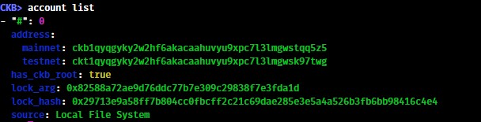
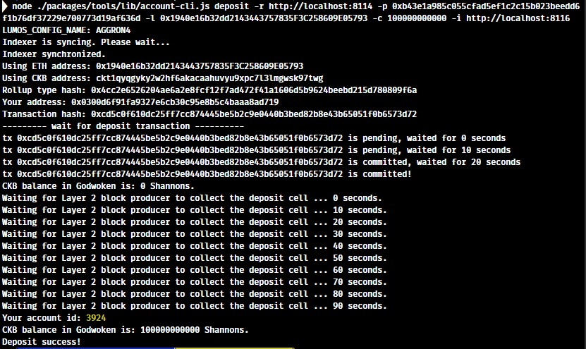

# Create A Godwoken Account On The EVM Layer 2 Testnet

Create A Godwoken Account On The EVM Layer 2 Testnet Gitcoin bounty: https://gitcoin.co/issue/nervosnetwork/grants/2/

1. A screenshot of the accounts you created (account list) in ckb-cli.

2. A link to the Layer 1 address you funded on the Testnet Explorer.

https://explorer.nervos.org/aggron/address/ckt1qyqgyky2w2hf6akacaahuvyu9xpc7l3lmgwsk97twg

3. A screenshot of the console output immediately after you have successfully submitted a deposit to Layer 2.

